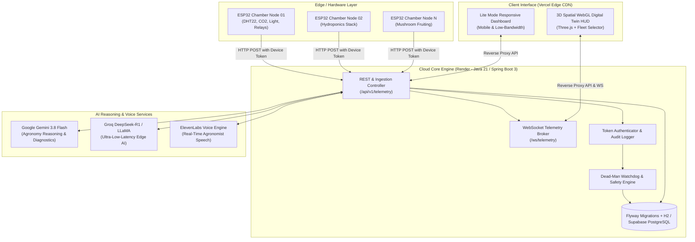

# 🌿 Project SAARTHI

**Smart Autonomous Assistant for Resilient Tech-Driven Horticulture & Indoor Farming**

> *"You grow the harvest. Saarthi steers the climate."*

[](https://project-saarthi-theta.vercel.app)
[](https://saarthi-backend-bvdl.onrender.com)
[](https://openjdk.org/)
[](https://spring.io/)
[](https://www.docker.com/)
[](./LICENSE)

---

## 🌐 Live Cloud Deployments

| Platform | Role | Live URL | Health / Status |
| :--- | :--- | :--- | :--- |
| **▲ Vercel (Edge CDN)** | Global Edge CDN, Spatial WebGL HUD & Reverse Proxy | **[https://project-saarthi-theta.vercel.app](https://project-saarthi-theta.vercel.app)** | 🟢 Live / Active |
| **🚀 Render (Core Engine)** | Spring Boot 3 Engine, WebSockets, DB & AI Gateway | **[https://saarthi-backend-bvdl.onrender.com](https://saarthi-backend-bvdl.onrender.com)** | 🟢 Live / Active |
| **📊 Render Dashboard** | Service Logs, Environment Secrets & Metrics | **[Render Console](https://dashboard.render.com/web/srv-datasbnavr4c73cqa63g)** | 🟢 Managed |

### 🔗 Public Access Endpoints
* **🖥️ 3D Spatial Digital Twin HUD (Vercel):** [https://project-saarthi-theta.vercel.app](https://project-saarthi-theta.vercel.app)
* **📱 Low-Bandwidth 2G-Friendly Lite HUD:** [https://project-saarthi-theta.vercel.app/lite.html](https://project-saarthi-theta.vercel.app/lite.html)
* **🖥️ Direct Backend HUD (Render):** [https://saarthi-backend-bvdl.onrender.com](https://saarthi-backend-bvdl.onrender.com)
* **📊 Multi-Chamber Fleet Snapshot API:** [https://saarthi-backend-bvdl.onrender.com/api/v1/telemetry/chambers](https://saarthi-backend-bvdl.onrender.com/api/v1/telemetry/chambers)
* **⚡ Real-Time Sensor Telemetry:** [https://saarthi-backend-bvdl.onrender.com/api/v1/telemetry/current](https://saarthi-backend-bvdl.onrender.com/api/v1/telemetry/current)
* **🔌 Real-Time WebSocket Telemetry Stream:** `wss://saarthi-backend-bvdl.onrender.com/ws/telemetry`

---

## 🏗️ System Architecture



---

## ✨ Core Innovations & Capabilities

1. **Autonomous Micro-Climate Steerage**:
   - Closed-loop environmental steering for humidity, temperature, CO₂, vapor-pressure deficit (VPD), and photoperiods.
   - Intelligent crop recipes tailored for high-value crops (Oyster/Shiitake mushrooms, leafy greens, micro-greens).

2. **Multi-Chamber Fleet Architecture**:
   - Each hardware node acts as an autonomous chamber with distinct device tokens, crop profiles, and watchdog timers.
   - Dynamic fleet discovery with multi-chamber switching on both desktop and mobile interfaces.

3. **Multi-Turn Generative AI Agronomist**:
   - Integrated with **Google Gemini (gemini-3.8-flash)** and **Groq Cloud** for real-time symptom analysis and yield optimization.
   - Real-time voice interaction powered by **ElevenLabs** with specialized multilingual grower dialogues.

4. **Zero-Trust Hardened Security**:
   - Cryptographic token authentication isolating device telemetry (`X-Device-Token`) from administrative control (`X-Operator-Token`).
   - Hardware-level dead-man watchdog flagging stale or disconnected chambers in under 180 seconds.

5. **Dual Spatial & Lite Interfaces**:
   - **WebGL 3D Digital Twin**: High-fidelity Three.js chamber visualization with live relay state animations.
   - **Lite Dashboard**: Ultra-fast HTML/CSS interface for low-connectivity rural farm environments.

---

## 🛠️ API Quick Reference

| Method | Endpoint | Description | Access |
| :--- | :--- | :--- | :--- |
| `GET` | `/api/v1/telemetry/chambers` | Snapshot of all active chambers in fleet | Public |
| `GET` | `/api/v1/telemetry/chambers/{id}` | Telemetry and status for specific chamber | Public |
| `GET` | `/api/v1/telemetry/current` | Active primary chamber real-time sensor reading | Public |
| `GET` | `/api/v1/telemetry/history` | Historical telemetry records (with `deviceId` filter) | Public |
| `POST` | `/api/v1/telemetry` | Ingest sensor telemetry from ESP32 node | Device Token |
| `POST` | `/api/v1/actuate` | Send actuation commands (fans, pumps, humidifiers) | Operator Token |
| `POST` | `/api/v1/ai/chat` | Multi-turn AI agronomy diagnostic query | Public / Operator |
| `POST` | `/api/v1/ai/voice` | Synthesize voice response for grower dialogue | Public / Operator |
| `GET` | `/api/v1/alerts/history` | Audit log of critical system & safety events | Operator Token |
| `WS` | `/ws/telemetry` | WebSocket broadcast for real-time telemetry stream | Token Verified |

---

## ⚙️ Environment Variables & Secrets

Configure your `.env` file (or set these inside your cloud deployment dashboards):

```env
# -------------------- Cloud AI & Voice --------------------
GEMINI_API_KEY=your_google_gemini_api_key
GROQ_API_KEY=your_groq_api_key
ELEVENLABS_API_KEY=your_elevenlabs_api_key
ELEVENLABS_DEFAULT_VOICE_ID=JBFqnCBsd6RMkjVDRZzb

# -------------------- Security Tokens --------------------
SAARTHI_DEVICE_TOKEN=your_secure_device_token_for_esp32
SAARTHI_OPERATOR_TOKEN=your_secure_operator_token_for_hud
SAARTHI_ENFORCE_TOKEN=true

# -------------------- Database & Networking --------------------
SERVER_PORT=8080
SERVER_ADDRESS=0.0.0.0
SAARTHI_CORS_ORIGINS=https://project-saarthi-theta.vercel.app,https://saarthi-backend-bvdl.onrender.com,http://localhost:8080
SPRING_DATASOURCE_URL=jdbc:h2:file:./data/saarthi;DB_CLOSE_DELAY=-1;AUTO_SERVER=TRUE;MODE=PostgreSQL
SPRING_DATASOURCE_USERNAME=saarthi
SPRING_DATASOURCE_PASSWORD=
```

---

## 💻 Local Development & Simulation

### 1. Run the Spring Boot Server
```bash
# Windows 1-Click Launch
run_server.bat

# Or using Maven
mvn spring-boot:run
```
Access the local WebGL HUD at **[http://localhost:8080](http://localhost:8080)**.

### 2. Multi-Chamber Simulation (Mock ESP32 Fleet)
You can simulate a live 3-node horticulture farm locally:
```bash
# Set your local device token
set SAARTHI_DEVICE_TOKEN=your_device_token

# Run mock generator for 3 simultaneous chambers
python scripts/mock_esp32_node.py --nodes 3
```
Watch the HUD chamber dropdown populate in real-time with live telemetry streams.

### 3. Build & Run with Docker
```bash
# Build the production image
docker build -t saarthi-backend:latest .

# Run the container
docker run -p 8080:8080 \
  -e SAARTHI_DEVICE_TOKEN=demo_device_token \
  -e SAARTHI_OPERATOR_TOKEN=demo_operator_token \
  saarthi-backend:latest
```

---

## ☁️ Cloud Deployment Setup

### Deploying to Render
1. In the **[Render Dashboard](https://dashboard.render.com)**, create a new **Web Service**.
2. Connect `https://github.com/Lohith-RC/SAARTHI.git`.
3. Choose **Docker** as the environment (Render automatically executes [`Dockerfile`](./Dockerfile)).
4. Add the required environment variables outlined in the [Environment Variables](#️-environment-variables--secrets) section.
5. Deploy service.

### Deploying to Vercel
The root directory includes [`vercel.json`](./vercel.json) pre-configured with edge proxying to the live Render backend:
```bash
# Deploy with Vercel CLI
npx vercel --prod
```
Or import the repository directly via **[Vercel Dashboard](https://vercel.com/new)**.

---

## 📁 Master Documentation Suite (`/docs`)

All formal architectural, agronomic, hardware, and commercial documentation is housed in [`docs/`](./docs):

| # | Document File | Key Topics Covered |
| :-: | :--- | :--- |
| **01** | 🎯 **[01_goals_and_milestones.md](./docs/01_goals_and_milestones.md)** | Strategic KPIs, phase milestones & release schedule |
| **02** | 🗺️ **[02_implementation_plan.md](./docs/02_implementation_plan.md)** | Technical architecture, virtual threads & subsystem WBS |
| **03** | 🔄 **[03_app_and_web_flow.md](./docs/03_app_and_web_flow.md)** | Telemetry state machines, WebSocket formats & UX views |
| **04** | 🛡️ **[04_security_safety_scan.md](./docs/04_security_safety_scan.md)** | Failsafe relays, watchdog timers & threat modeling |
| **05** | 🔌 **[05_hardware_bom_and_pinout.md](./docs/05_hardware_bom_and_pinout.md)** | ₹1,110 ($14) ESP32 BOM, schematic schematics & pinouts |
| **06** | 🎙️ **[06_voice_speech_script.md](./docs/06_voice_speech_script.md)** | Voice AI dialogue scripts, prompts & wake-word specifications |
| **07** | 💼 **[07_business_model_and_pitch.md](./docs/07_business_model_and_pitch.md)** | B2B grower SaaS economics, pilot pricing & pitch decks |
| **08** | 🍄 **[08_agronomy_knowledge_and_crop_recipes.md](./docs/08_agronomy_knowledge_and_crop_recipes.md)** | VPD, temperature, and humidity parameters for 12+ crops |
| **09** | 📋 **[09_pilot_grower_sla_and_terms.md](./docs/09_pilot_grower_sla_and_terms.md)** | Commercial grower pilot agreements, NDAs & warranties |
| **10** | ⚙️ **[10_api_reference_and_firmware_spec.md](./docs/10_api_reference_and_firmware_spec.md)** | Protocol schemas, FreeRTOS state loops & error codes |
| **11** | ⚔️ **[11_competitor_landscape_and_moat.md](./docs/11_competitor_landscape_and_moat.md)** | Competitive analysis (Priva, TrolMaster) & technology moat |
| **12** | 🏆 **[12_grant_and_hackathon_cheat_sheet.md](./docs/12_grant_and_hackathon_cheat_sheet.md)** | Investor FAQ, pitch deck blurbs & Agritech grant applications |

---

## 🔧 Hardware & ESP32 Firmware

Canonical ESP32 firmware is located in **[`firmware/saarthi_esp32_firmware.ino`](./firmware/saarthi_esp32_firmware.ino)** (FreeRTOS dual-core: sensor readings/relay fail-safes on Core 1, Wi-Fi + HTTP telemetry dispatch on Core 0).

Flash via PlatformIO:
```bash
platformio run -DSAARTHI_DEVICE_TOKEN='"my-secret-token"' -DSAARTHI_DEVICE_ID='"ESP32_CHAMBER_01"'
```

---

*Engineered with precision for autonomous agriculture by Founding Team: Product Engineering • Agronomy AI Systems • Cloud Architecture.*
