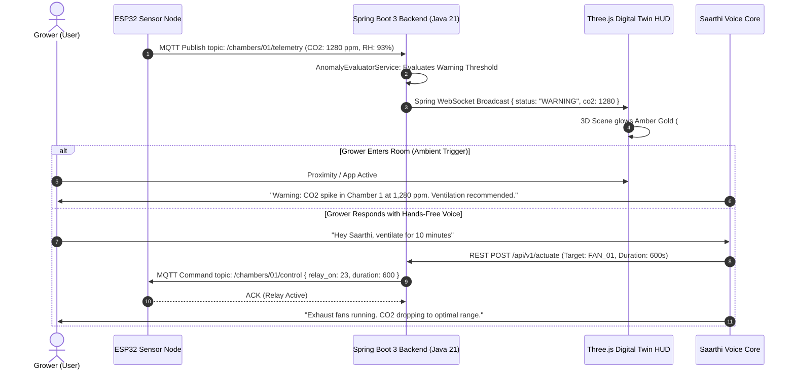

# 🔄 SAARTHI: Application, Web & User Experience Flows
> **State Machines, Sequence Diagrams & Data Payloads**
> **Backend Engine:** Spring Boot 3.x / Java 21 Reactive Architecture

---

## 1. End-to-End System Sequence Diagram



---

## 2. Real-Time Telemetry JSON Schema (Spring Boot DTO)

```json
{
  "deviceId": "SAARTHI_NODE_001",
  "facilityId": "URBAN_MUSHROOM_HQ",
  "chamberId": "ROOM_01_OYSTER",
  "timestamp": "2026-09-01T16:05:00.000Z",
  "metrics": {
    "co2Ppm": 845,
    "humidityRh": 91.2,
    "temperatureC": 22.4,
    "fanStatus": "OFF",
    "relayState": 0
  },
  "diagnostics": {
    "wifiRssi": -58,
    "sensorHealth": "OPTIMAL",
    "uptimeSeconds": 86420,
    "calibrationDriftIndex": 0.02
  }
}
```

---

## 3. UI State Transitions & Visual Logic

| State | Trigger Criteria | Primary HUD Color | 3D Lighting Effect | Audio Behavior |
| :--- | :--- | :--- | :--- | :--- |
| **🟢 OPTIMAL** | $CO_2 < 900$ ppm, RH 85–92%, Temp 20–24°C | Neon Emerald (`#00F5A0`) | Soft Green Ambient Glow | Silent ambient mode |
| **🟡 WARNING** | $CO_2$ 900–1,300 ppm OR RH $<80\%$ | Amber Gold (`#FFB800`) | Amber PointLight Pulse | Speaks warning upon entry |
| **🔴 CRITICAL** | $CO_2 > 1,400$ ppm OR Power Outage | Pulsing Crimson (`#FF3366`) | Rapid Red Emergency Flash | Triggers WhatsApp + IVR Phone Call |
