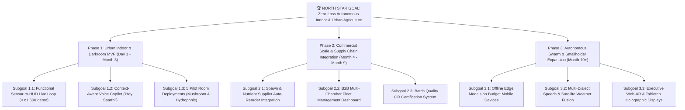
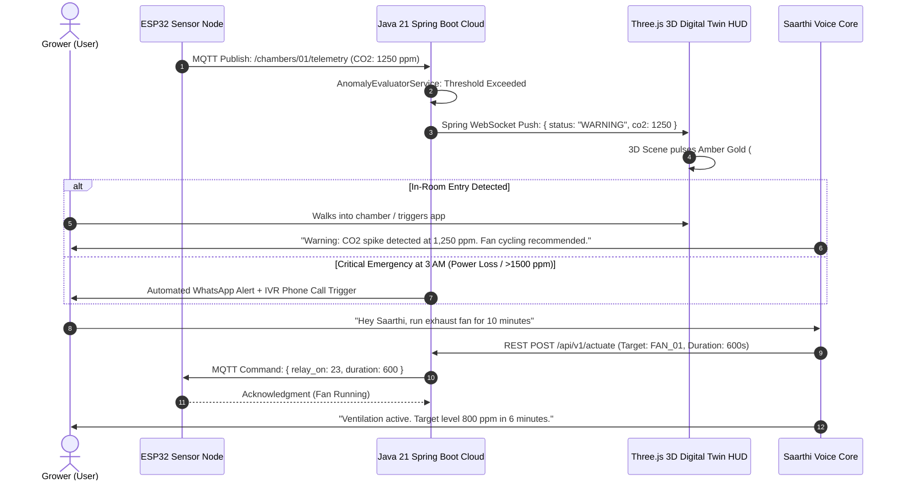

# 🌿 PROJECT SAARTHI: MASTER SPECIFICATION & ENGINEERING CHARTER
> **Smart Autonomous Assistant for Resilient Tech-Driven Horticulture & Indoor Farming**
> **Enterprise Architecture:** Java 21 LTS (Spring Boot 3.x) + Three.js 3D WebGL
> *"You grow the harvest. Saarthi steers the climate."*

---

## 📌 Table of Contents
1. [Master Goals & Subgoals Hierarchy](#1-master-goals--subgoals-hierarchy)
2. [Project Progress & Milestone Tracker](#2-project-progress--milestone-tracker)
3. [Implementation Plan & Technical Roadmap](#3-implementation-plan--technical-roadmap)
4. [App Flow & Web Architecture](#4-app-flow--web-architecture)
5. [Security, Safety & Reliability Assessment](#5-security-safety--reliability-assessment)
6. [Hardware Pinout & Bill of Materials (BOM)](#6-hardware-pinout--bill-of-materials-bom)
7. [Voice Dialogue & Speech State Machine](#7-voice-dialogue--speech-state-machine)

---

## 1. Master Goals & Subgoals Hierarchy



### 🎯 Key Performance Indicators (KPIs)
* **Zero Preventable Crop Loss:** $CO_2$ suffocation and pH drift incidents reduced by $> 85\%$ in pilot facilities.
* **Rapid Response Latency:** Local sensor anomaly to Java Spring Boot alert trigger $< 1.5$ seconds; voice query response $< 600$ ms.
* **Hardware Cost Accessibility:** Complete prototype node bill of materials $< ₹1,200$ ($15); commercial starter kit $< ₹7,999$ ($95).

---

## 2. Project Progress & Milestone Tracker

| Milestone ID | Deliverable / Task | Target Timeline | Status | Lead Owner |
| :--- | :--- | :--- | :--- | :--- |
| **M1.0** | Concept Finalization & Master Architecture | Day 1 | 🟢 **COMPLETED** | All Founders |
| **M1.1** | Pre-Code Documentation Suite (PRD, TDD, BOM) | Day 2 | 🟢 **COMPLETED** | Alex & Maya |
| **M1.2** | Interactive 3D Web HUD & Voice Simulator (Three.js) | Week 1 | 🟢 **COMPLETED** | Alex |
| **M1.3** | Java 21 + Spring Boot 3 Backend Telemetry Ingestion | Week 2 | 🟢 **COMPLETED** | Alex |
| **M1.4** | ESP32 + MQ-135 + DHT22 Hardware Bench Rig | Week 3 | ⚪ Pending | Alex |
| **M1.5** | Hackathon & Pitch Deck Asset Preparation | Week 3 | ⚪ Pending | Maya |
| **M1.6** | Multi-Chamber Fleet Backend (per-chamber state, WebSocket fleet push, fleet REST) | Week 3 | 🟢 **COMPLETED** | Alex |
| **M2.0** | Alpha Pilot Testing across 5 Grow Rooms | Month 2 | ⚪ Pending | Maya |
| **M2.1** | 3-Tier Alert Escalation Engine (WhatsApp / IVR) | Month 3 | ⚪ Pending | Alex |

---

## 3. Implementation Plan & Technical Roadmap

### Technical Stack Architecture
* **Frontend 3D HUD:** Three.js (WebGL) + HTML5 / CSS3 Glassmorphism + Web Audio API.
* **Voice Engine:** Web Speech API (`SpeechRecognition` + `SpeechSynthesis`) with localized intent mapping.
* **Backend Core:** **Java 21 (LTS) + Spring Boot 3.x** (Spring WebFlux, Spring WebSockets, Spring AI).
* **IoT Message Broker:** **Spring Integration + Eclipse Paho MQTT**.
* **Database Layer:** **Spring Data JPA + PostgreSQL / TimescaleDB**.
* **Firmware / IoT:** C++ / Arduino Framework on ESP32-WROOM with Async MQTT.

---

## 4. App Flow & Web Architecture



---

## 5. Security, Safety & Reliability Assessment

### A. Electrical & Cloud Fail-Safes
1. **The "Dead-Man’s Heartbeat" Watchdog:** Spring Boot `@Scheduled` watchdog checks for pings every 60s. If power fails, an alert fires within **3 minutes**: *"Power/Network lost in Chamber 1."*
2. **Local Hardcoded Failsafe:** Even if Wi-Fi and Cloud disconnect, the ESP32 internal chip triggers the relay if $CO_2 > 1,400$ ppm.
3. **Optocoupler Relay Isolation:** All AC fan/pump relays are opto-isolated to prevent high-voltage back-EMF spikes from frying microcontrollers.

### B. Biosecurity & Cleanroom Protection
1. **IP66 Sealed Enclosures:** Hardware casings must be smooth and sealed to allow 70% isopropyl alcohol wipe-downs between mushroom batches.
2. **Zero In-Chamber Airborne Motors:** Prohibit unsealed spinning projector fans in humid rooms to prevent green mold (*Trichoderma*) spore dissemination.

---

## 6. Hardware Pinout & Bill of Materials (BOM)

| Component | Function | Operating Voltage | ESP32 GPIO Pin | Unit Cost |
| :--- | :--- | :--- | :--- | :--- |
| **ESP32-WROOM-32D** | Core Microcontroller & Wi-Fi/BT Hub | 3.3V / 5V USB | Micro-USB | ₹400 |
| **MQ-135 Sensor** | Gas / $CO_2$ Air Quality Telemetry | 5V VCC | **GPIO 34 (ADC1_CH6)** | ₹140 |
| **DHT22 / SHT31** | Precision Temperature & Humidity | 3.3V VCC | **GPIO 4 (Digital I/O)** | ₹160 |
| **Status RGB LED** | Local Visual Health Indicator (G/A/R) | 3.3V | **GPIO 2 (Blue), 18 (G), 19 (R)** | ₹20 |
| **1-Channel Relay** | AC Exhaust Fan / Solenoid Control | 5V VCC | **GPIO 23 (Active LOW)** | ₹90 |
| **Breadboard + Wires** | Prototyping interconnects | N/A | Point-to-Point | ₹140 |
| **Transparent Casing** | Acrylic Display Housing | N/A | External | ₹200 |

---

## 7. Voice Dialogue & Speech State Machine

```
                              SAARTHI VOICE STATE TREE
                               ┌─────────────────────┐
                               │   IDLE / LISTENING  │
                               └──────────┬──────────┘
                                          │ Wake Word: "Hey Saarthi"
                                          ▼
                               ┌─────────────────────┐
                               │   AWAITING INTENT   │
                               └──────────┬──────────┘
             ┌────────────────────────────┼────────────────────────────┐
             ▼                            ▼                            ▼
      [Query Status]              [Actuate Climate]             [Log Harvest]
   "How is Room 1 doing?"     "Ventilate for 10 mins"       "Log 14kg from Rack 3"
             │                            │                            │
             ▼                            ▼                            ▼
 "Room 1 is optimal at 820    "Triggering FAE fan relay.   "Logged 14kg Oyster. Batch
  ppm CO2 and 91% humidity."   Auto-stop in 10 minutes."    total is now 48.5 kg."
```

---
*Authored by Founding Team: Product Engineering (Alex) • Operations & Strategy (Maya) • Lead Visionary*
